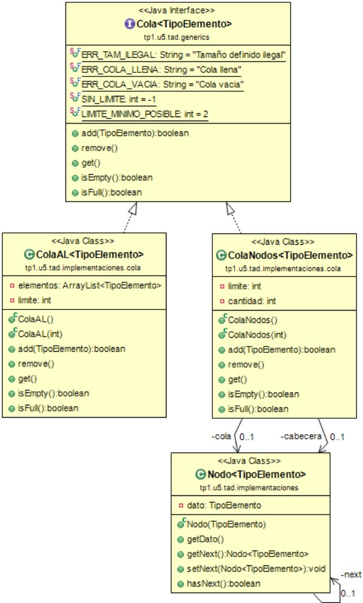

# 👀️ Repositorio en construccion 👀️

# Java 🚀️

* Con el lenguaje java apareció el concepto de Lenguaje orientado a objetos, ya que antes los lenguajes eran tipo "sabana" , todos de corrido.
* Al principio Java fue llamado Oak, y fue creado por la empresa Sun, antes de la explosion de internet. Busco una interfaz más cómoda, un lenguaje más fácil de usar y diversidad para escribir un código que funcione para varios dispositivos.
* Java es un lenguaje diseñado en los 90 por Sun Microsystems y ahora el dueño es Oracle. Es independiente de la plataforma, es decir, escribis el codigo solo 1 vez para que el mismo corra en varios dispositivos.
* Cada programa en java debe tener una clase, y todos los programas de java comienzan desde el main method que es publico, static (cualquiera puede acceder sin tener que instanciar la clase), void (no devuelve nada).
* Lo único malo que posee es que es un poco más lento que algunos programas de C por su tipo de lenguaje Byte Code que tiene que ser traducido en cada maquina donde es compilado el lenguaje.
* Funciona con la JVM (Java Virtual Machine) Gracias a este, cualquier programa java es ejecutable en cualquier sistema operativo, es como una mini maquina virtual que unifica todo.
* Recomiendo poner el codigo en un proyecto Java para poder ejecutarlo de manera mas facil.
* Es un lenguaje Case-Sensitive. Toda sentencia finaliza con punto y coma.
* Al principio Java fue llamado Oak, y fue creado por la empresa Sun, antes de la explosión de internet. Busco una interfaz más cómoda, un lenguaje más fácil de usar y diversidad para escribir un código que funcione para varios dispositivos
* El mismo código es multiplataforma. También, si tenes un browser compatible con Java, se puede ejecutar cualquier aplicación en la misma.
* Es orientado a objetos.
* Esta hecho en base a C++, pero Java es mas rápido de aprender y maneja mejor cuestiones de gestión de memoria.
* No es tan rápido como C por su tipo de lenguaje Byte Code que debe ser traducido en cada PC que compilará el lenguaje.
* Todas las clases de Java heredan de la clase base, `Object`.
* **Punteros** -> En Java no existen punteros (Invocar tipos de memoria), estos causaban muchos errores de compilación en C.
* **Variables Globales** -> Lo único global en Java son los nombres de las Clases. Las variables pueden cambiar según lo deseado.
* **Sentencias Goto** -> Sentencias que rompen la estructura del programa. Java reemplaza estos con `break` y `continue`.
* **Asignación Memoria** -> En C y C++ había que reservar memoria y luego liberarla cuando ya no era usada. Java posee un **Garbage Collector** que permite al programador olvidarse de estas gestiones.
* **Arquitectura Neutra** -> El compilador Java compila el codigo a un archivo independiente de la arquitectura de la PC donde sera ejecutado. Cualquier PC con solo tener el Runtime puede ejecutar el codigo.
* Al principio Java fue llamado Oak, y fue creado por la empresa Sun, antes de la explosión de internet. Busco una interfaz más cómoda, un lenguaje más fácil de usar y diversidad para escribir un código que funcione para varios dispositivos.

## Buenas practicas de Sintaxis

* Nombres de clases -> `NombreClase`
* Nombres Variables -> `nombreVariable`
  Solo puede contener letras, numeros (No pueden comenzar con un numero), guion bajo y "$". No puede contener espacios.
* Metodos -> `nombreMetodo()`

## Ventajas y Desventajas de Java

### Ventajas

* El mismo codigo funciona para cualquier sistema operativo.
* Es orientado a objetos
* Un browser compatible con java te va a ejecutar cualquier aplicacion java.
* Es un lenguaje y brinda todo lo que te brinda cualquier lenguaje.
* Brinda elementos multimedia a las paginas web.

### Desventajas

* No tienden a ser muy rapidos los programas.
* Sigue siendo un lenguaje de programacion que hay que aprender de cero.

## Diferencias Java con C y C++ 🚀️

* **Punteros**: En java no existen punteros que es una manera de invocar unos tipos de memoria, y que su uso inadecuado causaba errores de compilación en C.
* **Variables Globales**: En java lo único global es el nombre de las clases, las variables pueden cambiar mucho
* **Sentencias Goto**: Son la forma más rápida de arreglar un programa rompiendo su estructura secuencia. Java no tiene ninguna sentencia goto, pero posee las sentencias break y continue que cubren los casos importantes de goto.
* **Asignación de Memoria**: Reservar memoria en C o C++ implicaba la utilización de sentencias como new o mallocs, que creaban objetos en memoria, que el mismo programador era responsable de eliminar de la memoria una vez que se los dejaba de utilizar y en la mayoría de los casos se omitía hacerlo. Java, ante esta vicisitud, posee un Garbage Collector (recolector de basura) que permite al programador desligarse de tener que eliminar los objetos de memoria.
* **Conversión de tipos Insegura**: Los cambios de tipo (casting) son un mecanismo de C y C++ que permite cambiar el tipo de un puntero. Java provee una comprobación de tipos de datos al momento de castear un tipo en otro. El casting (a veces denominado casteo en el lenguaje informático) es la conversión automática de tipos. Por ejemplo, si asignamos un número entero a  una variable de tipo real, se debe hacer un “casteo” del tipo entero al real.
* **Es más simple**: Se creo un lenguaje parecido a C++ para su rapido aprendizaje, y además maneja mucho mejor la memoria.
* **Distribuido**: Java se ha construido con extensas capacidades de interconexión con el protocolo TCP/IP. Existen rutinas para acceder e interactuar con protocolos como http y ftp. El protocolo http se utiliza para conectarse a un recurso (por ejemplo un archivo o un servidor) dentro de una misma red de datos; mientras que el protocolo ftp se utiliza para transmitir archivos de un dispositivo a otro. Esto permite a los programadores acceder a la información a través de la red con tanta facilidad como a los archivos locales.
* **Robusto**: Java realiza verificaciones en busca de problemas tanto en tiempo de compilación como en tiempo de ejecución. La comprobación de tipos en Java ayuda a detectar errores, lo antes posible, en el ciclo de desarrollo. Java obliga a la declaración explícita de métodos, reduciendo así las posibilidades de error. Maneja la memoria para eliminar las preocupaciones por parte del programador de la liberación o corrupción de memoria.
  También implementa los arrays o arreglos auténticos, en vez de listas enlazadas de punteros, con comprobación de límites, para evitar la posibilidad de sobrescribir o corromper memoria.
* **Arquitectura Neutral**: Para establecer Java como parte integral de la red, el compilador Java compila su código a un archivo objeto de formato independiente de la arquitectura de la máquina en que se ejecutará. Cualquier máquina que tenga el run-time puede ejecutar ese código objeto, sin importar en modo alguno la máquina en que ha sido generado. El código fuente Java se "compila" a un código de bytes de alto nivel independiente de la máquina. Este bytecodes está diseñado para ejecutarse en una máquina hipotética que es implementada por un sistema run-time, que sí es dependiente de la máquina.
* **Seguro**: La seguridad en Java tiene dos facetas. En el lenguaje, se eliminan características como los punteros o el casting implícito que hacen los compiladores de C y C++, para prevenir el acceso ilegal a la memoria.
  El código de Java pasa muchos tests antes de ejecutarse en una máquina. El código se pasa a través de un verificador de bytecodes que comprueba el formato de los fragmentos de código y aplica un tester de teoremas para detectar fragmentos de código ilegal (código que falsea punteros, viola derechos de acceso sobre objetos o intenta cambiar el tipo o clase de un objeto).
  Si los byte-codes pasan la verificación sin generar ningún mensaje de error, entonces sabemos que:
  El código no produce desbordamiento de operandos en la pila
  El tipo de los parámetros de todos los códigos de operación es conocido y correcto.
  No ha ocurrido ninguna conversión ilegal de datos, tal como convertir enteros en punteros.
  El acceso a los campos de un objeto se sabe que es legal: public, private, protected.
  No hay ningún intento de violar las reglas de acceso y seguridad establecidas.
* **Portable**:  Más allá de la portabilidad básica por ser de arquitectura independiente, Java implementa otros estándares de portabilidad para facilitar el desarrollo. Java construye sus interfaces de usuario a través de un sistema abstracto de ventanas de forma que las ventanas puedan ser implementadas en entornos Unix, Pc o Mac.
* **Integrado**: El intérprete Java (run-time) puede ejecutar directamente el código objeto. Enlazar un programa, normalmente, consume menos recursos que compilarlo, por lo que los desarrolladores con Java pasarán más tiempo desarrollando y menos esperando por la ejecución. No obstante, el compilador actual del JDK es bastante lento. Por ahora, que todavía no hay compiladores específicos de Java para las diversas plataformas, Java es más lento que otros lenguajes de programación, como C++, ya que debe ser interpretado y no ejecutado como sucede en cualquier programa tradicional.
* **Multitema**: Primero, te contamos que los threads (hilos en español) son básicamente pequeños procesos o piezas independientes de un gran proceso. Java, al ser multithreaded, permite muchas actividades simultáneas en un programa. De esta manera, al estar los threads construidos en el lenguaje, son más fáciles de usar y más robustos que sus homólogos en C o C++.
  El beneficio de ser miltithreaded consiste en un mejor rendimiento interactivo y mejor comportamiento en tiempo real. Aunque el comportamiento en tiempo real está limitado a las capacidades del sistema operativo subyacente (Unix, Windows, etc.), aún supera a los entornos de flujo único de programa (single-threaded) tanto en facilidad de desarrollo como en rendimiento
* **Dinamico**: Java se beneficia todo lo posible de la tecnología orientada a objetos. Java no intenta conectar todos los módulos que comprenden una aplicación hasta el tiempo de ejecución. Las librerías nuevas o actualizadas no paralizarán las aplicaciones actuales.
  Para evitar que haya que estar trayendo los módulos de byte-codes o los objetos o nuevas clases de la red cada vez que se necesiten, se implementan las opciones de persistencia, para que no se eliminen cuando se limpie la caché de la máquina.

## Scanner

Tipos de Scans que puedo hacer:

* `nextByte()`
* `nextShort()`
* `nextInt()`
* `nextLong()`
* `nextFloat()`
* `nextDouble()`
* `nextBoolean()`
* `nextLine()`
* `next()` (Una sola palabra)

## Organización general desde el Workspace hasta la Clase

Dentro del workspace, encontraremos una estructura arbolada donde el primer nivel estará formado por los proyectos. Dentro de cada proyecto (aunque esto es a elección del programador, pues puede no hacerse así cambiando un seteo de Eclipse) contendrá dos ramas gemelas, donde una contendrá los archivos fuente (los .java) mientras que la otra contendrá los binarios o bytecode, generados por Java al compilar (los .class).

* Workspace
  * Proyecto
    * bin
      * Paquete
        * Archivo bytecode (.class)
    * src
    * Paquete
    * Archivo Fuente (.java)

## Packages

Definimos como package (paquete) a una “carpeta lógica” donde quedarán los archivos fuente que generemos. Decimos que son carpetas lógicas para diferenciarlos de las carpetas físicas, que es como se organizan casi todos los sistemas operativos (recordemos que Java, y también Eclipse, existen para muchos sistemas operativos distintos).

Un package determina, además, el namespace al que debemos referirnos para acceder a un recurso específico (uno o más archivos fuentes).

Para definir un paquete, se usa la palabra clave package seguida por un nombre de paquete legal. La declaración termina con un punto y coma.

A menudo, los nombres de los paquetes se separan con puntos, y siguen esta estructura de nombres de facto:

`package tipoorganizacion.nombreorganizacion.nombreaplicacion.nombrepaquete;`

Ejemplo:

`package ort.tprog1.tp1;`

Recordemos, también, que por cada parte del nombre del package (cada parte es separada de la otra por un punto) se creará una carpeta, anidándolas una dentro de la otra, desde la primera hasta la última. Por ejemplo, las carpetas del ejemplo anterior serán:

* ort
  * tprog1
    * tp1

## Clases

Siendo Java un lenguaje pensado bajo el paradigma de la Programación Orientada a Objetos (POO), todo programa escrito con él estará formado por al menos una clase.

#### Nombre del Archivo

El nombre de los archivos fuente Java siempre empieza con mayúsculas, al igual que la primera letra de cada palabra que compone su nombre (sin espacios). La extensión es.java.

Ejemplo:

MiClase.java

En este caso contendrá una clase llamada MiClase.

#### Estructura declarativa de una clase

```
[visibilidad] [atributo] class ClassName {
// contenido
}
```

### Visibilidad

También conocido como Especificador de Acceso, este modificador indica desde dónde es posible ver y/o acceder a la clase. Puede ser public o no declararse; si la clase no pertenece a un paquete (si está “suelta” dentro del proyecto), ambas definiciones son equivalentes; pero si la clase pertenece a un paquete la cosa cambia: si se declara public la clase podrá utilizarse fuera del paquete, pero si no se la declara como pública sólo podrá utilizarse dentro del paquete.

### Atributo

Solo hay dos atributos para clases: abstract y final. La primera (abstract) indica que la clase no está completa (porque tiene al menos un método abstracto, propio o heredado); el atributo final indica que esta clase no podrá tener clases derivadas (ninguna clase podrá heredar de ella). Durante este cuatrimestre trabajaremos sobre todos estos conceptos.

### ClassName

Corresponde al nombre de la clase. Debe coincidir con el nombre del archivo .java y la notación debe ser capitalizada (es decir que cada inicial está en mayúscula, y el resto en minúsculas).

## Campos de Clase (Atributos)

La definición de los campos de una clase tiene el siguiente formato:

visibilidad [atributo] tipodeDato nombreAtributo [= valorInicial];

#### Visibilidad o especificador de acceso

Los valores que puede tomar son:

| public | Puede ser visto desde cualquier lado, como clase o como instancia. No es recomendable, salvo en el caso de las constantes. |
| - | - |
| protected | Limitada a la misma clase y a las clases que la heredan. No es visible desde el objeto instanciado. |
| private | Solo puede ser visto desde dentro de la clase. |
| [paquete] | Si el modificador de visibilidad no se indica, sucede lo mismo que con las clases en sí: siendo la clase miembro de un paquete, el atributo es visible desde dentro del paquete. Tampoco es muy recomendable. |

#### Atributos

Los atributos modificadores de un campo de clase pueden ser:

| static | Indica que se trata de un atributo o campo de clase, y no de instancia. Cuando es atributo de clase, todas las instancias de la clase comparten el mismo valor. |
| - | - |
| final | Una vez asignado su valor no puede ser cambiado. Se comporta como una constante. En este caso, su nombre se escribe completamente en mayúsculas, separando cada palabra de su nombre, si éste es completo, con un guión bajo (“_”). |

Como se indica al final de sentencia, los atributos pueden recibir un valor inicial durante su declaración. Salvo en el caso de los campos estáticos y constantes (static y static final) se recomienda hacer la inicialización de los valores en el constructor de la clase. Si no se les asigna un valor específico en el constructor, los campos tomarán como valor el valor por defecto de su tipo de dato. Por ejemplo, los objetos valdrán null.

Ejemplos:

`private int codigoProducto;`

`public static final float CASI_PI = 314.1592;`

## Metodos

Los métodos de una clase responden a la siguiente declaración y estructura:

```
visibilidad [abstract][final] tipoRetorno nombreMetodo([listaArgumentos]) {
// instrucciones;

}
```

| visibilidad | Siendo también miembros de la clase como los campos, los métodos tienen las mismas características en cuanto a la visibilidad. Puede ser public, protected, private o no declararse, por lo cual será visible desde dentro del package. |
| - | - |
| abstract | Se declara como abstract (abstracto) aquel método que solamente se declara, y cuyo código deberá ser implementado en alguna clase derivada. Con tener un solo método abstracto, propio o heredado, la clase también deberá ser abstracta. |
| final | Significa que este método no podrá ser sobreescrito por ninguna clase derivada. |
| tipoRetorno | Tipo de dato a devolver por el método. Puede ser void (y el método no tendrá la cláusula return) y de algún tipo, sea este nativo, el nombre de una clase o cualquier otra definición de tipo de dato más compleja (colecciones, etc.) |
| nombreMetodo | Nombre del método, y se lo usará para invocarlo acompañado de paréntesis y, si es necesario, con los parámetros correspondientes. Debe escribirse en formato camelCase. |
| listaArgumentos | Enumeración de cada uno de sus argumentos o parámetros. De cada uno se tiene si tipo de dato y su nombre, y se separan entre sí con una coma. |

Luego van todas sus instrucciones encerradas entre llaves, incluyendo la declaración y definición de sus variables locales, si las tuviese. Si el método no es de tipo void, su última instrucción debería ser un return acompañado por el valor final de retorno.

Ejemplos:

```java
public getCodigo(){
return codigo;
}
public abstract calcularPago(float valor);
```

## Constructores

Los constructores son los métodos de inicialización de las clases por excelencia. Son tan especiales que no pueden ser invocados salvo con el operador new cuando queremos crear una instancia de la clase, o en forma especial desde dentro de los mismos constructores utilizando las cláusulas this (que veremos enseguida) y super (que aún no utilizaremos).

La estructura de un constructor es:

```
visibilidad nombreClase([listaArgumentos]) {
instrucciones;

}
```

En el caso de los constructores, la visibilidad puede ser public o private (sí, un constructor puede ser privado, más adelante veremos cómo puede usarse).

Una misma clase puede tener ninguno, uno o más constructores, siempre y cuando éstos no tengan la misma firma de declaración.

Es posible que un constructor invoque a otro de la misma clase a través de la cláusula this. Veamos un ejemplo:

```
public class Producto {

public Producto() {


this(0};


}

public Producto(int codigo) {


this.codigo=codigo;

}

}
```

En este caso, el primer constructor se aprovecha del segundo para setear el campo códigoen cero.

## Metodo main()

Los métodos main() son los puntos de acceso al programa desde el exterior, cuando los programas son invocados.

Java no genera ejecutables, pero todo programa debe tener un punto de entrada. Cualquier clase puede tener este método, pero solamente uno de ellos será el punto de entrada y será ejecutado en primer lugar.

Este método debe ser public y static. Puede recibir argumentos a través del array de strings args.

Ejemplo completo de un programa que recibe argumentos desde la línea de comandos del sistema:

```java
package ort.tprog1.demo;

public class Demo{

public static void main(String[] args) {
System.out.println("Ejecutando… mis argumentos son:");

   for (int i=0; i<args.length; i++) {

       System.out.println(args[i]);

   }
}
}
```

# Excepciones 👀️

Cuando ejecuto mi programa, y sucede un error, por default el programa se corta y no funciona más, no pasa al paso siguiente del error.
Son objetos que contienen la info necesaria para saber que paso, informando todo el camino que tomo el programa. Son instancias de clases que pertenecen a un arbol jerarquico, es decir, cada excepcion tiene cierta importancia en sí misma.

En java todos los errores estan categorizados.

* **Arrojable (Throwable)** : Es una interfaz que posee dos clases, exception y error. java.lang.Error es irrecuperable (StackOverflowError es cuando desbordas la pila de llamadas, OutOfMemoryError, etc..), en exception sí son zafables (RunTimeException(excepcion en tiempo de ejecucion) son las más tipicas, IOException problemas de archivos|rutas, SQLException  , AWTException es cuando trabajamos con interfaces graficas que ya es obsoleto e InterruptedException tiene que ver con procesos)
* **Checked exception**: Son funciones que sí o sí requieren un try catch en sí mismos, ya que sí falla seria un error grave.

Las excepciones tienen tipo, poseen jerarquia y nos permite depurar mejor, ya que sabemos cual fue la causa del error y tomar recaudos del mismo.

La excepcion devuelve una pila de llamadas en donde detecto el inconveniente (todos los que llaman a eso que fallo por orden).

Catch no es un metodo, es un bloque de codigo.

```
try{ //Cadena de instrucciones a ejecutar al principio

            int x = Consola.LeerEntero(); //El usuario puede                ingresar cualquier cosa

            System.out.println(“El doble es “ + 2*x;
}

catch(InputMismatchException ime){ //Si sucede esta excepcion, mostrar este mensaje

             System.out.println(“No era un entero”);

}
```

Puedo poner más de 1 catch sí es el caso. Sí pongo (Exception e) es una excepcion generica, prevee todas las excepciones.

Puedo hacer excepciones personalizadas haciendo una clase Public class ExcepcionPersonalizada extends RuntimeException (sí no es check, de lo contrario solo Exception), puedo agregar varios constructores referentes a excepcion, que reciben un String, etc..

En el caso de un constructor que recibe un String...

```
public ExcepcionPersonalizada (String msj){

  super(msj);

}
```

y lo lanzamos en la clase deseada de la siguiente forma

```
if (Condicion que no es valida){


  throw new ExcepcionPersonalizada(“Mensaje que recibe mi Excepcion como String”);


}
```

## Proceso de compilacion. ❤️

1. **Crear** nuestro nuevo archivo  `.java`
2. **Compilar** nuestro archivo, ya que debe ser comprendido por la maquina virtual. Esto con `javac nuestroproyecto.java`. Esto generara un archivo del mismo nombre pero con la extension `.class`. Esto es el codigo binario.
3. **Ejecutamos** el proyecto con `java nuestroproyecto`

**¿Qué es la Java Virtual Machine? (JVM)?**
Gracias a la JVM, cualquier programa Java es ejecutable de forma multiplataforma. Es una VM que unifica todo.


## Estructura del Programa ❤️

`public class HolaMundo {}` -> Clase principal que contendra a nuestro programa.
`public static void main(String[] args){}` -> Metodo main. `args` hace referencia a argumentos. El metodo main es nuestro entry point.
`System.out.println("Hola Mundo!")` -> Sentencia ejecutada cuando el programa esta corriendo.

## Variable ❤️

Una variable es un espacio en memoria que puede almacenar un valor o un dato.

* Es un dato que se pierde cuando el programa acaba. La unica manera de "guardarlo" es si lo almacenamos en una BD.
* Debo de estar conciente, al momento de declarar mi variable, que tanto puede crecer.
* Un atributo `static` mantendra la unica instancia para todos los objetos de la misma clase y de las subclases.

En Java hay varios tipos de variables, conocidos como **datos primitivos** como por ejemplo:

* booleano -> `boolean`
* byte -> `byte` (-128 a 127)
* Entero corto -> `short` (-32,768 a 32,767)
* Entero -> `int` (Cualquier numero entero)
* Entero Largo -> `long` (Numeros aun mas grandes que el int)
* Doble -> `double` (Incluye decimales)
* Flotante -> `float` (Es mas pequeño que double)
* Caracter -> `char` (Caracteres)

Tambien estan los tipos de datos **Abstractos** que son creados por el desarollador mismo.

**¿Cómo declaro una variable?**
`tipoDeVariable nombreVariable = valorDeVariable;`
`int miNumero = 10`
`int variable1, variable2, variableConValor = 3;`

# Tipo Abstracto de Datos (T.A.D) ❤️

Esta compuesto de una estructura donde se guardan los datos y un conjunto de metodos que hacen respetar ciertas reglas de modelado de datos (Como quiero tratar a los datos).

* Surge del **tipo abstracto de dato**, es la evolucion de la estructura de datos, como el vector.

#### Ejemplo

Necesito guardar un conjunto de 5 enteros que se mantengan siempre ordenados, tanto al eliminar como al agregar uno nuevo.

**Solucion** -> Guardo estos datos en un vector de 5 enteros, y defino dos metodos, `agregarNumero(int numero)` y `eliminarNumero(int numero)`. Al usar un vector, utilize un **Tipo abstracto de Dato**.

**Estructura** -> El vector
**Metodos para modelar los datos** -> Los dos metodos
**Regla a Respetar** -> Que los numeros se mantengan ordenados

**¿Que son TDA?**

* Pila (El primero que entra es el primero que sale, LIFO)
* Cola (El primero que entra es el primero que sale, FIFO)
* Cola con Prioridad (El orden de salida esta dado por prioridad, el primero en salir es el dato con mayor prioridad)
* Conjunto (Coleccion de datos unicos, se obtiene el elemento al azar)
* Diccionario Simple.
* Diccionario Multiple.
* Arbol (Elementos ordenados por jerarquia, entre dos elementos se define padre e hijo. La raiz del arbol no tiene padre)
* Grafo (Elementos llamados vertices relacionados por un conjunto de aristas, y cada arista tiene un valor asociado, el peso)

## Diccionario Simple

Conjunto de pares asociados con clave y valor. Las claves son unicas y no pueden ser nulas. Cada clave tiene un solo valor.

**Metodos**

* `Inicializar()` -> Inicializa diccionario.
* `Agregar (int c, int x)` -> Agrega un elemento x a una clave c. El diccionario debe estar inicializado y la clave no debe ser repetida.
  Si la clave es nueva, se agrega a la primera posicion libre del vector, y si la clave existe no se actualiza.
* `Eliminar (int c)` -> Elimina la clave que pasas por parametro. Debe existir. Al eliminar, se mueve al elemento que estaba en la posicion anterior en el vector a la posicion del elemento que se saco.
* `int Obtener (int c)` -> Devuelve el elemento de la clave. No lo elimina.
* `ConjuntoTDA claves()`-> Devuelve el conjunto de claves del diccionario.

## Diccionario Multiple

Lo mismo que el simple pero pueden haber muchos valores en una sola clave

**Metodos**

* `inicializar()`
* `agregar(int c, int x)`
* `eliminar(int c)`
* `eliminarValor (int c, int x)` -> Elimina el valor de la clave
* `ConjuntoTDA obtener (int c)` -> Devuelve el conjunto de valores bajo una clave.
* `ConjuntoTDA claves()` -> Devuelve todas las claves vigentes

## Colas



**Regla** -> Es una estructura FIFO (First In, First Out), los elementos se sacan en el mismo orden en el que fueron agregados.

Se puede implementar de 2 maneras:

**Usando un ArrayList** -> Debemos agregar los elementos al final con el propio `add()` del arrayList, siempre sacando el primer elemento usando el `remove(0)` y chequear si la cola esta vacia con `isEmpty()`

**Con nodos** -> Puede parecer mas complicada pero es mas simple y eficiente. Con esta implementacion no se produce el desplazamiento interno de todos los elementos del ArrayList cuando se saca al primer elemento.

Creamos la cola:

`Cola<Persona> filaDePasajeros = new ColaNodos<>();`

Agregamos a una persona a la lista:

`filaDePasajeros.add(new Persona());`

Vemos los elementos disponibles:

`System.out.println("Primera persona en la lista" + filaDePasajeros.get());`

Quitamos o vemos al primer elemento en la fila:

`filaDePasajeros.remove()`

## Pilas


Es un tipo abstracto de dato que debe simular el comportamiento de una Pila en la vida real.

**Regla** -> El ultimo que entra es el primero que sale (L.I.F.O)

**Metodos de Modelado** -> `apilar()`, `desapilar()`, `estaVacia()`, `estaLlena()` (Si definimos un limite). Los metodos, sin embargo, suelen llamarse `push(), pop() y peek()`.

Se puede implementar de manera similar a la cola.

Creamos la cola:
`Pila<Caja> pilaDeCajas = new PilaNodos<>();`
Agregamos una caja a la pila:
`pilaDeCajas.push(new Caja());`
Vemos los elementos disponibles:
`pilaDeCajas.peek();`
Sacamos la primera caja:
`pilaDeCajas.pop();`

## Nodo vs Dato

No hay que confundir al **nodo con el dato**. El nodo es el contenedor circunstancial del dato. No se puede acceder a la cadena de nodos.

